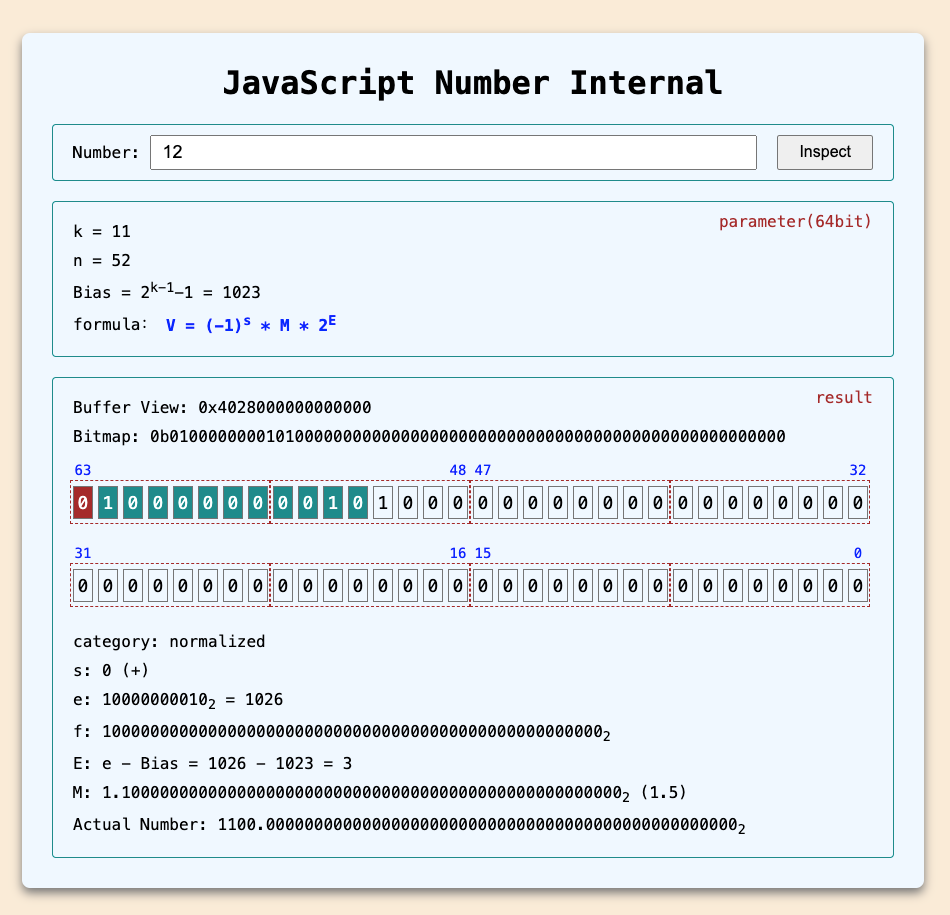

# js-number-internal
JavaScript中的Number类型的内部表示

## 实现原理
首先，构造一个8字节的内存块：
```js
const buffer = new ArrayBuffer(8)
```

然后，基于这个内存块分别创建一个`Float64Array`视图和`Uint8Array`视图：
```js
const view_uint8 = new Uint8Array(buffer)
const view_float64 = new Float64Array(buffer)
```

这样，当我们用`float`的方式给这块内存赋值时，就可以通过`uint8`的方式观察内存结构了。
```js
view_float64[0] = 12
console.log(view_uint8) // [0, 0, 0, 0, 0, 0, 40, 64]
```

处理下字节序，就可以得到12在这8个字节中的位模式了。
```js
0x4028000000000000
```


